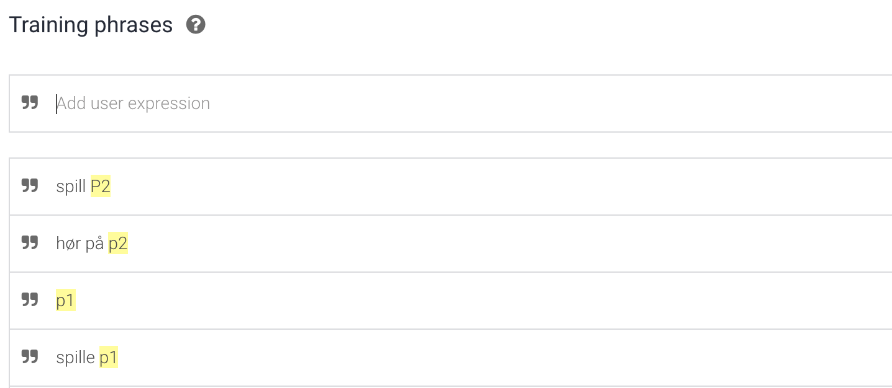
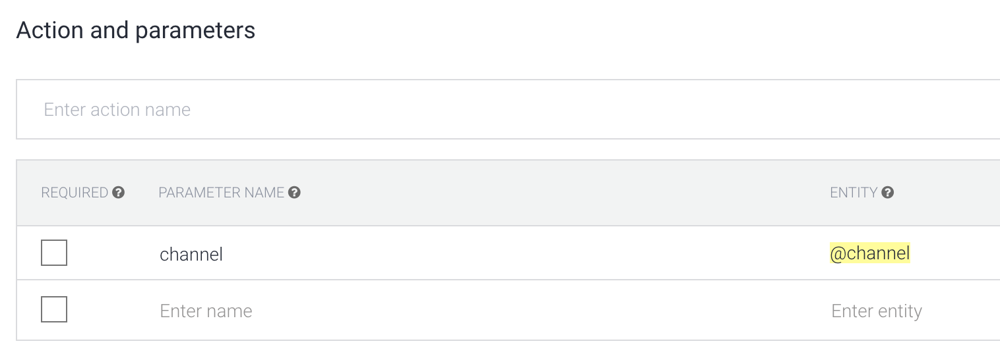
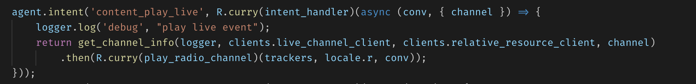
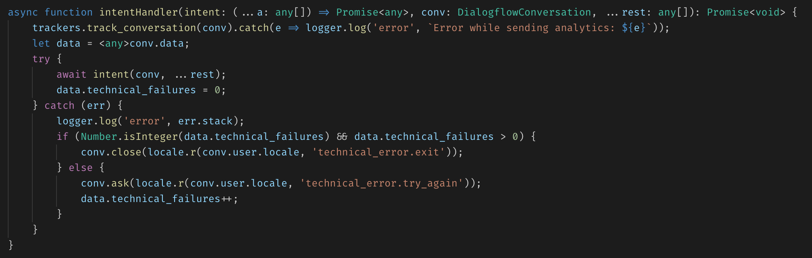
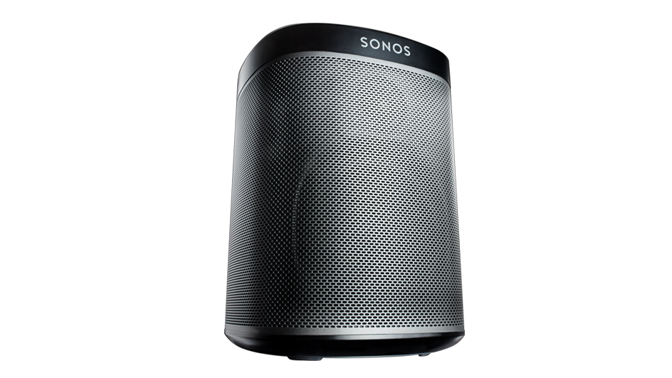
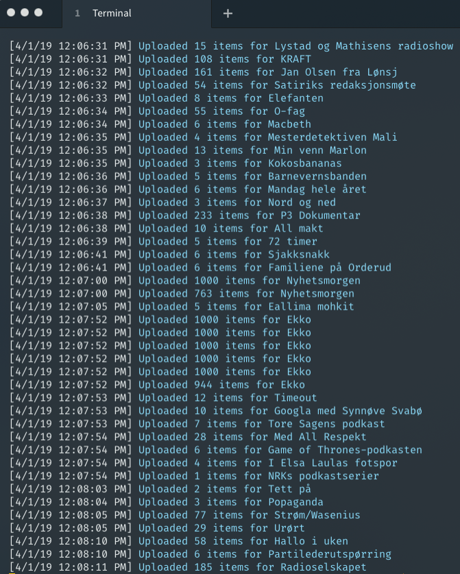
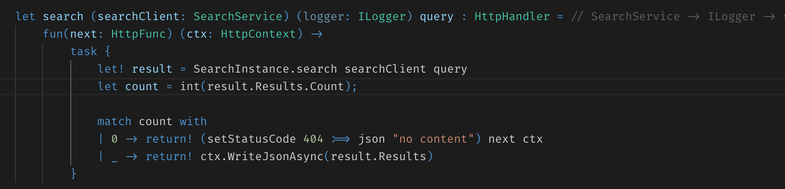
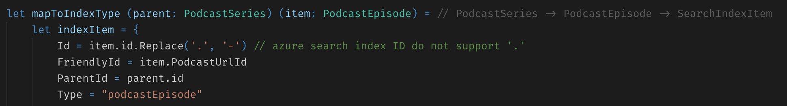
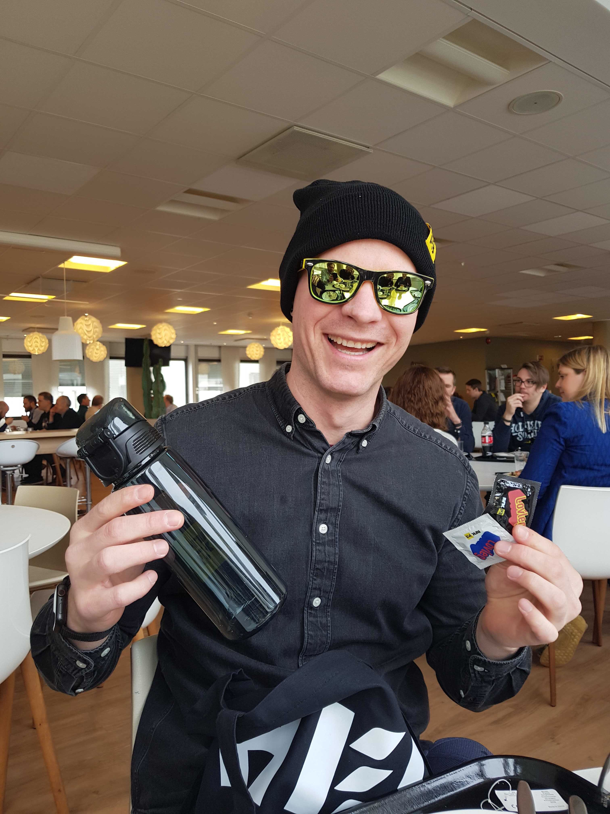

---

## Ingve @ NRK

Google Home API

Sonos API

Azure Search

---

<small>API - API - API - API - API - API - API - API - API</small>

⬆
️

Steibrudd | Steinbrudd | Steinbrudd | Steinbrudd

⬆

### GRANITT

---

## Google Home

---

* Typescript prosjekt
* Kjører i k8s
* Bygg og deploy i Jenkins

---

* Det jeg har jobbet minst med
* Lagt opp lagring av lyttehistorikk mot Table Storage

---

* "Snakk med NRK" - en Google Action
* Baserer seg på "Intents" håndtert via webhook
* Definert opp i DialogFlow

---

*"Spill P1"*

---

---

### Gotchas med Google Home

<small>VELDIG mange brukere på julaften (NRK Action)</small>

<small>Ikke så mange nå lenger</small>

<small>Talestyring litt prematurt? Samt snever plattform ennå</small>

---

## Sonos

---

* Soap
* API definert av wsdl-fil fra Sonos
* Kjører i Azure
* Bygg i TC, Deploy i 🐙 ( -> Azure DevOps?)
* musicpartners.sonos.com
* Må bruke PC 💩 (.NET Framework)

---

<small>Tilgjengeliggjøring av On Demand innhold</small>

---

### Gotchas om SONOS
<small>Tidkrevende 🙁</small>

<small>Gammeldags?</small>

<small>Vanskelig med state handling</small>

---

## Azure Search

---

* Cloud search service
* NRK ønsker å gå vekk fra gammel Elastic instans
    * Dyrt
    * Lite vedlikeholdbar per i dag
    * Lite kunnskap rundt oppsett/kode/indeksering

---

<small>Indekserer opp podkast og radioserier i sekssifret antall</small>

<small>Kjører som en Azure Function</small>

---

https://github.com/giraffe-fsharp/Giraffe

---

* Holder på med et API for Azure Search
* Skrives i F#
* Brukes Giraffe som rammeverk
* Planlegger å kjøre i k8s

---

### Gotchas om Azure Search

<small>Kan ikke rename en index - må slette og opprette på nytt</small>

<small>Id kan ikke inneholde punktum</small>

---

### Cool @ NRK

<small>Ansvar for egen kode</small>

<small>Frihet til å velge</small>

<small>Valg av maskinplattform</small>

<small>Høyt fokus på sky og PaaS</small>

---

### Takk

